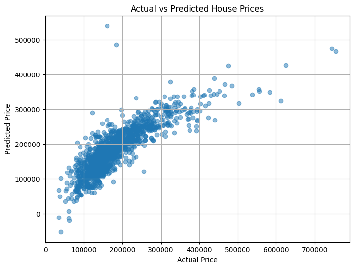

# 🏠 House Price Predictor (PRODIGY_ML_01)

A Streamlit app that predicts house prices using a Linear Regression model trained on the Kaggle Housing dataset.

## 🎥 Demo
Watch the demo video to see the app in action:
- **Video Demo**: [HousePricePredictionDemo-ezgif.com-video-to-gif-converter.gif](./HousePricePredictionDemo-ezgif.com-video-to-gif-converter.gif)

## 📸 Screenshots
- **Price Prediction Interface**: 
- **Perfect Prediction**: 

## 🚀 Try it Now
Access the live app here:  
👉 [https://house-prices-predictor.streamlit.app/](https://house-prices-predictor.streamlit.app/)

## 🧠 Features
- Predicts **house prices** using:
  - Living Area (GrLivArea)
  - Number of Bedrooms
  - Number of Full Bathrooms
- Built with **Streamlit** and **scikit-learn**
- Includes a trained model (`model.pkl`)
- GUI-ready and internship-submission friendly
- Interactive sliders and input fields for easy prediction

## 📦 How to Run the App

### Prerequisites
- Python 3.7+
- pip package manager

### Installation & Setup

1. **Clone the repository:**
```bash
git clone https://github.com/Ayush-Bitla/PRODIGY_ML_01.git
cd PRODIGY_ML_01
```

2. **Install dependencies:**
```bash
pip install -r requirements.txt
```

3. **Run the Streamlit app:**
```bash
streamlit run app.py
```

4. **Access the app:**
The app will open in your default browser at `http://localhost:8501`

## 📊 Model Details
- **Algorithm**: Linear Regression
- **Dataset**: Kaggle Housing Dataset
- **Features**: Living Area, Bedrooms, Full Bathrooms
- **Model File**: `model.pkl` (trained model)

## 🛠️ Project Structure
```
PRODIGY_ML_01/
├── app.py                 # Main Streamlit application
├── model.pkl             # Trained machine learning model
├── requirements.txt      # Python dependencies
├── PRODIGY_ML_01.ipynb  # Jupyter notebook with model training
├── House Price Prediction Demo.mp4  # Demo video
├── perfect prediction.png # Screenshot of perfect prediction
├── price.png            # Screenshot of price prediction interface
└── README.md           # This file
```

## 🤝 Contributing
Feel free to submit issues and enhancement requests!

## 📝 License
This project is part of the PRODIGY ML internship program.
